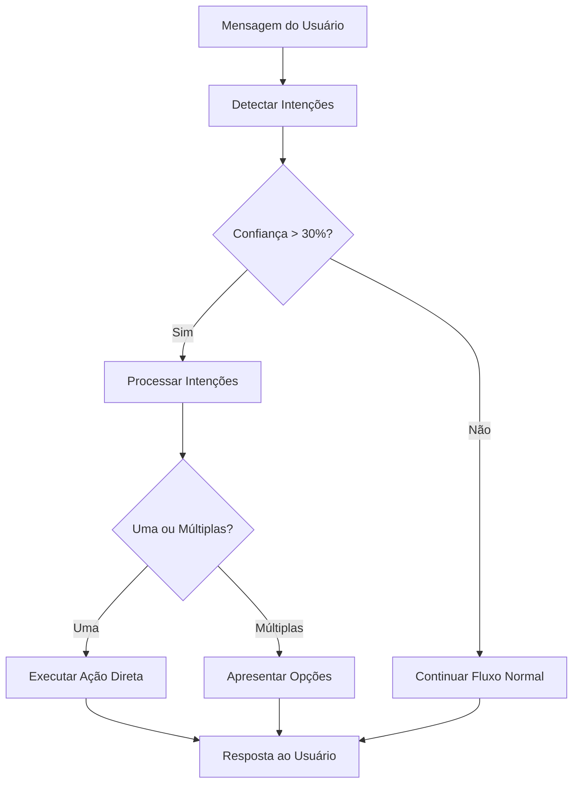

# Sistema de Detecção de Intenções - WhatsAuto Chatbot

## 📋 Visão Geral

O Sistema de Detecção de Intenções é uma funcionalidade avançada que permite ao chatbot identificar automaticamente a intenção do usuário em qualquer momento da conversa, proporcionando uma experiência mais natural e fluida.

## 🎯 Objetivos

- **Detecção Global**: Identificar intenções em qualquer ponto da conversa
- **Contextualização**: Considerar o estado atual do usuário
- **Flexibilidade**: Permitir mudança de assunto natural
- **Extensibilidade**: Facilitar adição de novas intenções
- **Inteligência**: Calcular níveis de confiança

## 🏗️ Arquitetura

### Componentes Principais

1. **`src/config/intentions.js`** - Configuração de intenções
2. **`src/services/intentionService.js`** - Lógica de detecção
3. **`src/handlers/messageHandler.js`** - Integração com fluxo principal
4. **`src/examples/addNewIntention.js`** - Exemplos de extensão

### Fluxo de Processamento



## 🔧 Configuração de Intenções

### Estrutura de uma Intenção

```javascript
{
  id: "IDENTIFICADOR_UNICO",
  name: "Nome Amigável",
  description: "Descrição da funcionalidade",
  priority: 10, // 1-10 (maior = mais prioritário)
  keywords: ["palavra1", "palavra2", ...], // Palavras-chave
  phrases: ["frase completa", ...], // Frases que indicam a intenção
  action: "nome_da_acao", // Ação a ser executada
  state: "ESTADO_DESTINO", // Estado para o qual levar o usuário
  examples: ["Exemplo 1", "Exemplo 2", ...] // Exemplos para usuário
}
```

### Exemplo Prático

```javascript
CERTIDOES: {
  id: "CERTIDOES",
  name: "Certidões",
  description: "Emitir certidões negativas, positivas, regularidade fiscal",
  priority: 9,
  keywords: [
    "certidao", "negativa", "positiva", "regularidade", 
    "fiscal", "emitir", "gerar", "documento"
  ],
  phrases: [
    "preciso de uma certidão",
    "emitir certidão negativa",
    "certidão de regularidade"
  ],
  action: "initiate_certidoes",
  state: ESTADOS.AGUARDANDO_TIPO_CONTRIBUINTE,
  examples: [
    "Preciso de uma certidão negativa",
    "Emitir certidão de regularidade"
  ]
}
```

## 🧠 Algoritmo de Detecção

### Cálculo de Score

1. **Palavras-chave encontradas**: +10 pontos cada
2. **Frases completas encontradas**: +20 pontos cada
3. **Prioridade da intenção**: +1 a +10 pontos
4. **Boost de contexto**: até +5 pontos

### Boost de Contexto

- **Mesmo contexto**: +5 pontos
- **Mudança de assunto**: +2 pontos
- **Histórico do usuário**: +3 pontos

### Cálculo de Confiança

```javascript
confidence = Math.min(score * 2, 100)

// Ajustes:
// - Mensagem muito curta: × 0.5
// - Frase completa encontrada: × 1.3
// - Máximo: 100%
```

## 🎛️ Níveis de Confiança

- **< 30%**: Ignorar intenção
- **30-50%**: Intenção fraca, processar com cuidado
- **50-70%**: Intenção moderada, apresentar opção
- **> 70%**: Intenção forte, executar diretamente

## 🔄 Integração com messageHandler

### Pontos de Integração

1. **Início do processamento**: Detecção global
2. **Estados críticos**: Bypass em CPF/Inscrição
3. **Processamento de ações**: Execução das intenções
4. **Fallback**: Continua fluxo normal se não há intenção

### Estados Críticos (Sem Detecção)

- `AGUARDANDO_CPF_CNPJ`
- `AGUARDANDO_INSCRICAO`

### Exemplo de Log

```
🎯 [IntentionService] Detecção: {
  sender: "5511999999999@c.us",
  confidence: 85,
  topIntentions: [
    { id: "DEBITOS", name: "Consulta de Débitos", confidence: 85 }
  ],
  context: { isChangingTopic: false, isCanceling: false }
}
```

## 📝 Como Adicionar Nova Intenção

### Passo 1: Configurar a Intenção

Adicione em `src/config/intentions.js`:

```javascript
NOVA_INTENCAO: {
  id: "NOVA_INTENCAO",
  name: "Nome da Nova Funcionalidade",
  description: "Descrição detalhada",
  priority: 6,
  keywords: ["palavra1", "palavra2"],
  phrases: ["frase completa"],
  action: "initiate_nova_funcionalidade",
  state: "ESTADO_NOVA_FUNCIONALIDADE",
  examples: ["Exemplo de uso"]
}
```

### Passo 2: Implementar a Ação

Adicione em `src/handlers/messageHandler.js`, função `processarAcaoIntencao`:

```javascript
case "initiate_nova_funcionalidade":
  definirEstadoUsuario(sender, ESTADOS.ESTADO_NOVA_FUNCIONALIDADE);
  return gerarMenuNovaFuncionalidade(nome);
```

### Passo 3: Criar Estado (se necessário)

Adicione em `src/config/constants.js`:

```javascript
ESTADOS = {
  // ... estados existentes
  ESTADO_NOVA_FUNCIONALIDADE: "estado_nova_funcionalidade",
}
```

### Passo 4: Testar

Use `src/examples/addNewIntention.js` ou `src/tests/intentionService.test.js`.

## 🧪 Testes

### Executar Testes

```bash
# Testes automatizados
node src/tests/intentionService.test.js

# Exemplos práticos
node src/examples/addNewIntention.js
```

### Tipos de Testes

1. **Detecção única**: Uma intenção clara
2. **Múltiplas intenções**: Ambiguidade
3. **Contexto**: Mudança de assunto
4. **Processamento**: Execução de ações
5. **Extensibilidade**: Adicionar/remover intenções
6. **Histórico**: Memória do usuário
7. **Cancelamento**: Detectar saída
8. **Confiança baixa**: Mensagens vagas

## 📊 Monitoramento

### Logs Importantes

```
🎯 [IntentionService] Detecção: {...}
✅ [IntentionService] Processando intenção: {...}
🔧 [MessageHandler] Processando ação de intenção: {...}
```

### Métricas Sugeridas

- Taxa de detecção de intenções
- Distribuição de confiança
- Intenções mais utilizadas
- Taxa de mudança de contexto
- Accuracy da detecção

## 🔍 Debugging

### Habilitar Logs Detalhados

Os logs já estão integrados. Para mais detalhes, adicione em `intentionService.js`:

```javascript
console.log("🔍 Análise detalhada:", {
  mensagem: normalizedMessage,
  scores: intentions.map(i => ({ id: i.id, score: i.score })),
  contexto: context
});
```

### Verificar Configuração

```javascript
const stats = intentionService.getStats();
console.log("📊 Estatísticas:", stats);
```

## ⚡ Performance

### Otimizações Implementadas

1. **Cache de regex**: Palavras normalizadas uma vez
2. **Early exit**: Para para em alta confiança
3. **Limite de intenções**: Máximo 3 por resposta
4. **Estados críticos**: Bypass automático

### Recomendações

- Máximo 50 palavras-chave por intenção
- Máximo 20 intenções totais
- Limpar histórico periodicamente
- Monitorar uso de memória

## 🚨 Troubleshooting

### Problemas Comuns

1. **Intenção não detectada**
   - Verificar palavras-chave
   - Aumentar prioridade
   - Adicionar frases específicas

2. **Confiança muito baixa**
   - Palavras-chave muito genéricas
   - Frases muito complexas
   - Ajustar algoritmo de score

3. **Múltiplas intenções sempre**
   - Palavras-chave sobrepostas
   - Prioridades similares
   - Refinar configuração

4. **Não executa ação**
   - Verificar `processarAcaoIntencao`
   - Estado crítico ativo
   - Erro na implementação

### Debug Rápido

```javascript
// Testar detecção específica
const result = intentionService.detectIntentions(
  "sua mensagem de teste",
  "debug_user",
  "MENU_PRINCIPAL"
);
console.log(result);
```

## 🔮 Futuras Melhorias

1. **Machine Learning**: Treinar modelo com conversas reais
2. **Contexto histórico**: Usar conversas anteriores
3. **Análise semântica**: Usar NLP mais avançado
4. **A/B Testing**: Testar diferentes configurações
5. **Analytics**: Dashboard de métricas
6. **Auto-tuning**: Ajustar scores automaticamente

## 📚 Referências

- [Documentação principal](README.refatorado.md)
- [Exemplos práticos](src/examples/addNewIntention.js)
- [Testes automatizados](src/tests/intentionService.test.js)
- [Configuração de intenções](src/config/intentions.js)
- [Código principal](src/services/intentionService.js)

---

*Sistema desenvolvido para o WhatsAuto Chatbot da Prefeitura de Arapiraca*
